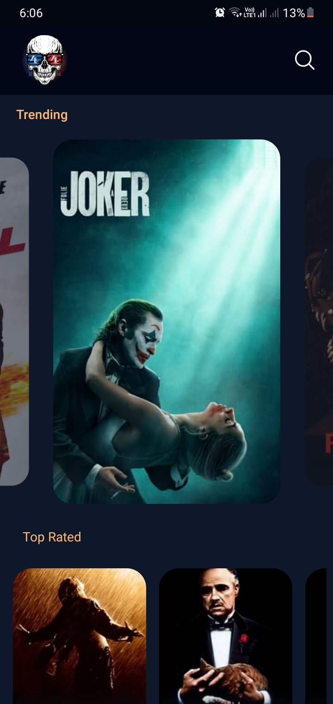
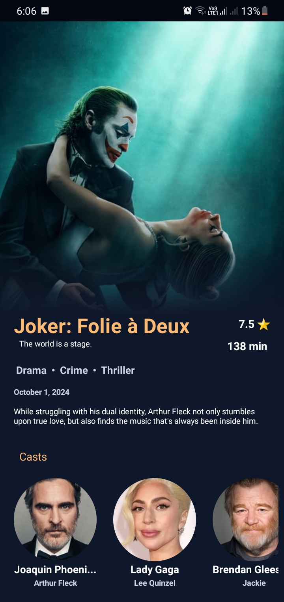
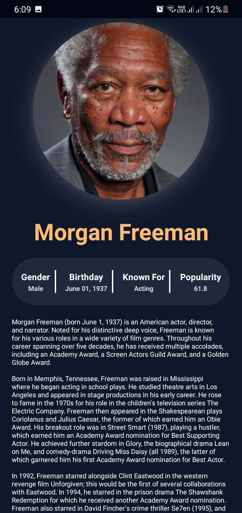

# Skull Movies

  
  
  

 

## Get Started

install dev dependencies

### `npm install`

## Then

Run The app

### `expo start`

Runs your app in development mode.

Open it in the [Expo app](https://expo.io) on your phone to view it. It will reload if you save edits to your files, and you will see build errors and logs in the terminal.

 

💙 If you like this project, give it a ⭐ and share it with friends!
